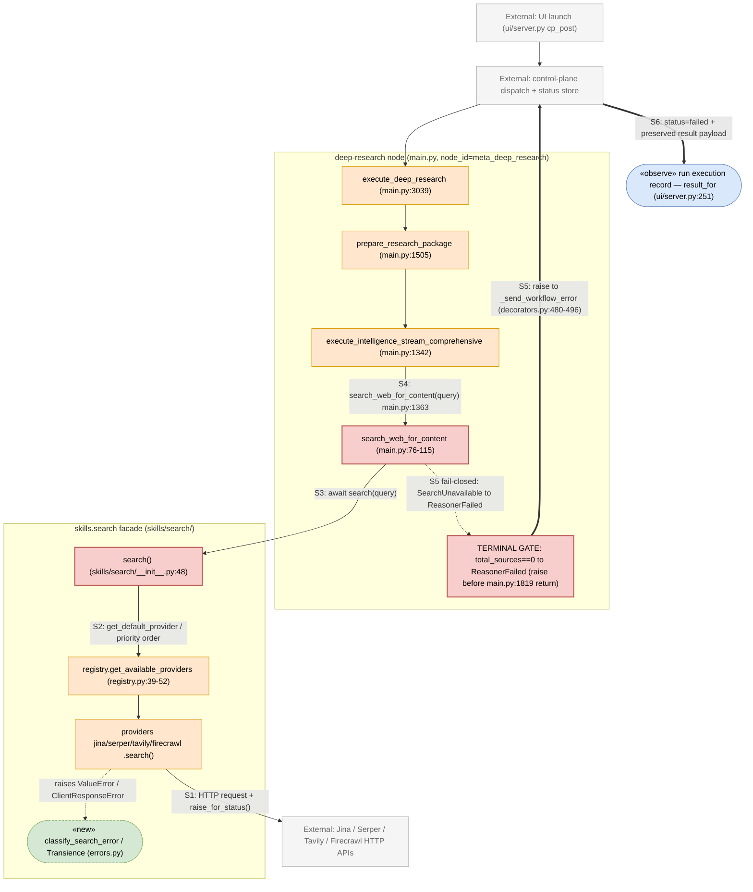
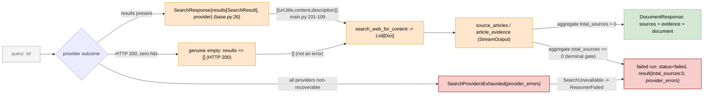

# Search-Provider Fail-Closed Hardening — TDD Implementation Plan

**Bead**: `silmari-agentfield-system-b2y` (feature, P1) · Follow-up: `silmari-agentfield-system-lsn` (P3)

## Overview

Make web-search failures **fail closed**. Today every failure class (no providers, provider
not available, HTTP/API error such as Jina `402`) is swallowed into `[]` at
`search_web_for_content` (main.py:76-115), so a run with zero real sources still produces a
confident, uncited document and is recorded `succeeded`. This slice replaces the silent swallow
with: (a) error classification, (b) transient retry, (c) priority-ordered provider fallback,
(d) a descriptive raise carrying the underlying API error when search *capability* is gone, and
(e) a terminal per-run gate that fails via `ReasonerFailed` (preserving the partial result) when
all iterations yield zero sources.

Derived from research: `thoughts/searchable/shared/research/2026-07-20-09-28-search-provider-failclosed.md`
(Design Decisions 1–6 + Reconciliation note).

**Implementation status (2026-07-20): landed and locally verified.** Historical line citations
below identify the pre-implementation baseline. The primary implemented symbols are now
`search_web_for_content` (main.py:92), `prepare_research_package` (main.py:1563), the terminal
gate (main.py:1900), `execute_deep_research` (main.py:3131), `search()`
(skills/search/__init__.py:93), and `classify_search_error`
(skills/search/errors.py:31).

## Current State Analysis

### Key Discoveries
- **Swallow seam**: `search_web_for_content` returns `[]` on no-providers (main.py:94-95),
  `RuntimeError` (main.py:110-112), and any `Exception` (main.py:113-115). Sole call site
  main.py:1363.
- **Facade already raises**: `search()` raises `RuntimeError` when no provider, else propagates
  the provider exception (skills/search/__init__.py:48-67). Providers raise `ValueError` on
  missing key and `response.raise_for_status()` on HTTP error (jina.py:40-53, serper.py:61-78,
  tavily.py:50-68, firecrawl.py:59-84).
- **Availability = key presence only**, not health (base.py:56-59) — an out-of-balance key
  reports available; failure only surfaces at request time.
- **Forced provider never falls back on request failure**: `get_default_provider()` only falls
  through when the preferred key is *missing* (registry.py:80-94).
- **No downstream gate**: empty results flow through `StreamOutput` (main.py:1493-1501) →
  `prepare_research_package` metadata `total_sources`/`final_quality_score` (main.py:1819-1836)
  → `execute_deep_research` → doc generation (main.py:3133-3142), with no count check. Doc
  pipeline fallbacks require non-empty facts so they don't fire when empty
  (doc_generation_pipeline.py:833-851, 925-944).
- **Framework fail-closed idiom**: a reasoner that **raises** → control-plane `status="failed"`
  + message, then re-raise (agentfield/decorators.py:459-496). Plain `return` is always
  `succeeded`; `ReasonerFailed(message, result=...)` records `failed` while preserving the
  result payload (agentfield/exceptions.py:36-71).
- **Injection seam for tests**: `register_provider(name, cls)` mutates the provider registry
  (registry.py:107-119) — lets tests install a fake provider (the seedable source) without
  mocking HTTP. `SEARCH_PROVIDER` env forces selection (registry.py:80-85).
- **Test framework**: pytest; `testpaths = ["tests"]`; `integration` marker for DB tests
  (pyproject.toml:77-82). No existing tests over `skills/search/` or `search_web_for_content`.

## Desired End State

### Observable Behaviors
- Given a transient provider error, when searching, then the provider is retried (bounded) and,
  on eventual success, results are returned.
- Given the selected provider returns a non-recoverable error, when other providers are
  available, then the next provider in priority order is used and the failed attempt is logged;
  if all providers fail, the same error is also retained in `provider_errors`.
- Given search *capability* is gone (no providers configured, or every available provider
  returned a non-recoverable error), when searching, then a descriptive error is **raised**
  carrying each provider's underlying API error — never `[]`.
- Given a provider responds successfully but with zero results, when searching, then `[]` is
  returned (a genuine empty result is not an error).
- Given all research iterations complete with `total_sources == 0`, when the run finishes, then
  it fails via `ReasonerFailed` with `result={"total_sources": 0, "provider_errors": [...]}` and
  the control plane records `status="failed"`. **`provider_errors` is populated per path**: on the
  *capability-gone* path (no providers, or every available provider non-recoverable) it carries
  one entry per attempted provider; on the *genuine-empty terminal-gate* path (providers answered
  HTTP 200 with zero hits) no provider error was ever recorded, so it is `[]` and the diagnostic
  is `total_sources == 0` (see System-Map grammar `result_capability_gone` vs `result_terminal_gate`).
- Given zero capability at run start, when the run begins, then it fails immediately without
  running empty iterations.

## What We're NOT Doing
- Not touching `utils.py:search_jina_ai` / the `research_orchestrator.py` subsystem (dead
  relative to the UI entrypoint) — tracked in bead `silmari-agentfield-system-lsn`.
- Not adding provider **health** probes to `is_available()` (key-presence semantics unchanged);
  health is discovered at request time via classification + fallback.
- Not changing the doc-generation pipeline's content behavior; the gate prevents reaching it
  with zero sources rather than altering its prompts.
- Not adding new search providers.

## Testing Strategy
- **Framework**: pytest (`uv run --extra dev pytest`).
- **Test types**: Unit (classification, provider fallback/retry, swallow-seam, `SEARCH_PROVIDER`
  forcing) with fake providers via `register_provider`; Reasoner-level (zero-capability immediate
  fail, terminal zero-source gate); one **Closure** test (search failure → failed run outcome).
- **Setup/mocking**: install `FakeProvider` classes through `register_provider` and force with
  `SEARCH_PROVIDER`; inject a no-op sleep for retry backoff so tests never wait. No aiohttp/HTTP
  mocking, no real network. All new test files under `tests/search/` and `tests/pipeline/`.
- **LLM injection seam (hermetic reasoner chain — REQUIRED for the closure test)**: every model
  call in `main.py` funnels through the single module-level wrapper
  `ai_with_dynamic_params(*args, **kwargs)` (main.py:118-129), which is the sole caller of
  `app.ai` (main.py:129). All 27 inference-schema sites across `main.py` and the document
  pipeline — `classify_query_adaptive` (main.py:2287, called
  first at main.py:1522), evidence/synthesis extraction (main.py:1456), and the doc pipeline's
  injected `ai_call=` (main.py:3017) — reach the network only through it. The closure/reasoner
  tests therefore monkeypatch **`main.ai_with_dynamic_params`** with a `fake_ai` async stub that
  returns canned, well-typed payloads keyed by the requested `schema` and validated with
  `schema.model_validate` (classification → a `QueryClassification`, evidence → extraction
  objects, doc-gen → its requested stage schemas). This makes the real reasoner chain run deterministically
  **offline with no credentials**. The fake AI is the injected inference boundary; the fake
  provider remains the search source-of-truth. (Do **not** stub the reasoners themselves — only
  the AI seam and the provider registry, so every new search/gate seam is really exercised.)
- **Fixture isolation (hermetic providers — REQUIRED)**: `register_provider` mutates the
  module-global `PROVIDER_CLASSES` **and** appends to `DEFAULT_PROVIDER_PRIORITY` with **no
  removal API** (registry.py:107-119), and `get_available_providers()` admits a provider only if
  `is_available()` (real env-key presence, base.py:56-59). The `fake_providers` / `register_fake`
  / `no_providers` fixtures MUST therefore:
  - (a) **snapshot and restore** `PROVIDER_CLASSES` and `DEFAULT_PROVIDER_PRIORITY` around each
    test (save copies in setup, reassign contents in teardown) so a registered `"stub"` never
    leaks into later tests;
  - (b) **`monkeypatch.delenv`** all four real keys (`JINA_API_KEY`, `TAVILY_API_KEY`,
    `FIRECRAWL_API_KEY`, `SERPER_API_KEY`, `raising=False`) so only the fake is available and no
    real provider is ever selected/hit;
  - (c) define `FakeProvider(SearchProvider)` implementing the abstract `name` /
    `api_key_env_var` properties and **overriding `is_available()` to return `True`** (otherwise
    `get_available_providers()` skips it), plus the seeded async `search()`.
  - `no_providers` clears the registry / restores an empty available set (not "assume a clean
    env") so the zero-capability test is deterministic regardless of the host's env keys.
- **In-process awaited span**: Python calls use `async`/`await`, but every edge is awaited by the
  trigger and requires no out-of-process drain, clock, or driver. The `fake_ai` stub resolves
  immediately (no sleep).

## Workflow Closure

Derived from the research `Workflow Closure Map` (do not invent). The chain:

### Production Operation Chain
`execute_deep_research (trigger) -> prepare_research_package -> execute_intelligence_stream_comprehensive -> search_web_for_content -> skills.search.search -> [provider response] ... -> ReasonerFailed raise -> framework status="failed" (decorators.py:480-496) -> run execution record (result_for, ui/server.py:251)`

### Closure Test: "A search-provider failure surfaces as a failed run carrying the underlying error, not a succeeded source-less document."   [BLOCKING: crosses reasoner→control-plane registration boundary]
- **SOURCE (seed only)** — two injected boundaries, both hermetic:
  - **search source-of-truth**: a `FakeProvider` registered via `register_provider`
    (registry.py:107) whose `search()` raises a seeded error (e.g. an `aiohttp`-style
    non-recoverable 402) or returns HTTP-200-but-empty results — the provider response is the
    source-of-truth boundary for this behavior.
  - **inference boundary**: `main.ai_with_dynamic_params` is monkeypatched with a `fake_ai`
    async stub (main.py:118-129 is the sole `app.ai` caller). This neutralizes all 27
    inference-schema sites
    calls the trigger chain makes *before and around* the search seam — `classify_query_adaptive`
    (main.py:1522, first thing `prepare_research_package` does), evidence/synthesis
    (main.py:1456), and the doc pipeline (`ai_call=` at main.py:3017) — so the chain runs
    **offline, deterministically, without LLM credentials**. `fake_ai` is source-only (canned
    payloads); the search seam and terminal gate are still exercised for real.
- **TRIGGER (start)**: `execute_deep_research(query=...)` (main.py:3039)  (boundary = outermost
  entrypoint = `min(outermost entrypoint, highest_new_connector)` here, since ≥
  `highest_new_connector` = `search_web_for_content`, main.py:76 — every new seam
  (`search()` fallback → `search_web_for_content` re-raise → `prepare_research_package` gate) is
  crossed).
- **DRIVERS (async edges)**: none — every coroutine is awaited in-process by the trigger. No
  sleeps or external drains are required; `fake_ai` is `async` but resolves immediately.
- **OBSERVE (assert via)**: the raised `ReasonerFailed` from `execute_deep_research` — its
  `message` carries the provider's underlying error and `result` carries the partial payload +
  recorded failures. The decorator maps the raise to `status="failed"`
  (agentfield/decorators.py:480-496); the top-level execution handler preserves
  `ReasonerFailed.result` (agentfield/agent.py:2580-2598). Both are framework-owned LEAF
  behavior, asserted by reading rather than re-implemented here (see seam S6).
- **FORBIDDEN SPAN**: the test must not call/seed/mock `search_web_for_content`,
  `execute_intelligence_stream_comprehensive`, `prepare_research_package`, or the doc pipeline —
  only the `FakeProvider` + `fake_ai` (sources) and `execute_deep_research` (trigger) are touched.
  Stubbing the AI seam is *not* stubbing a reasoner: the reasoners run their real control flow.
- **RED-AT-SEAM proof**: with the fail-closed gate removed (or `FakeProvider` returning results),
  `execute_deep_research` returns a normal `DocumentResponse` — produced by the `fake_ai`
  stubbed doc-gen inference, not live doc generation — (green run) → asserts the test is actually
  exercising the seam; with the `FakeProvider` seeded to fail/empty on all providers,
  `ReasonerFailed` must be raised (red-at-seam).
- **DRIVABILITY**: store/source seams present via `register_provider` + `main.ai_with_dynamic_params`
  monkeypatch (always available in-process); no async edge so no clock/driver needed. No required
  seam missing.
- **EXECUTION (must run)**: pure in-process pytest — installs the fake provider **and** the
  `fake_ai` inference stub, then calls the real reasoner chain. **No external infra and no LLM
  credentials** (the AI seam is stubbed; the guarantee now holds). If `register_provider` or the
  `main.ai_with_dynamic_params` monkeypatch is unavailable the test FAILS-CLOSED (red), it does
  not skip. (The separate assertion that the framework posts `status="failed"` reads
  agentfield/decorators.py behavior; it is not gated on a live control plane.)

---

## System Map

Boundaries, seams, and the grammar of every interface + contract that crosses each seam.
Nodes **this slice changes** are drawn with the `gap` style (`search_web_for_content`, the
`search()` facade, and the terminal zero-source gate). Completeness over tidiness: anything not
fully pinnable yet is listed in §Flagged.

### System boundary diagram



### Failure sequence diagram

Fail-closed flow: provider `402` -> classify non-recoverable -> fallback exhausted ->
`SearchProvidersExhausted` -> `SearchUnavailable` -> `ReasonerFailed` -> framework
`status="failed"`.

```mermaid
sequenceDiagram
    participant R as prepare_research_package / execute_deep_research
    participant S as search_web_for_content (main.py:76)
    participant F as search() facade (__init__.py:48)
    participant C as classify_search_error (errors.py NEW)
    participant P as provider.search() (jina.py:40-53)
    participant H as Jina HTTP API
    participant FW as framework (decorators.py)
    participant CP as control plane / run record

    R->>S: search_web_for_content(query)
    S->>F: await search(query)
    F->>P: provider.search(query) in priority order
    P->>H: HTTP GET/POST
    H-->>P: 402 Payment Required
    P-->>F: raise ClientResponseError(status=402)
    F->>C: classify_search_error(exc)
    C-->>F: Transience.NON_RECOVERABLE
    Note over F: no retry; record (provider,error); try next provider
    F->>F: every available provider non-recoverable
    F-->>S: raise SearchProvidersExhausted(provider_errors)
    S-->>R: raise SearchUnavailable(message, provider_errors)
    Note over R: capability gone OR terminal total_sources==0
    R-->>FW: raise ReasonerFailed(message, result={total_sources:0,...})
    FW->>CP: _send_workflow_error -> status="failed" + result
    Note over FW,CP: decorators.py:480-496 then re-raise
```

### Data-flow diagram

How a search outcome becomes one of the **two** terminal states — a sourced `DocumentResponse`,
or a failed run carrying the provider errors.



### Seam inventory

| Seam | From → To | Kind | Interface | Contract artifact(s) |
|---|---|---|---|---|
| **S1** | provider `.search()` → external HTTP API | HTTP boundary | HTTP request + `response.raise_for_status()` (jina.py:40-53, serper.py:61-78, tavily.py:50-68, firecrawl.py:59-84) | success → `SearchResponse`; failure → `ValueError` (missing key) / `aiohttp.ClientResponseError` (`.status`) — never `[]` |
| **S2** | providers → `search()` facade | in-process registry | `get_default_provider()` / `get_available_providers()` (registry.py:39-94); `SEARCH_PROVIDER` forces (registry.py:80-85) | priority-ordered `List[SearchProvider]`; `is_available()` = key presence only (base.py:56-59) |
| **S3** | `search()` facade → `search_web_for_content` | in-process — **swallow seam being hardened** | `await search(query) -> SearchResponse` (\_\_init\_\_.py:48-67; raises `RuntimeError` at :63) | today `[]` on any error (main.py:110-115); NEW: `SearchProvidersExhausted` → `SearchUnavailable`; genuine empty still `[]` |
| **S4** | `search_web_for_content` → `execute_intelligence_stream_comprehensive` | in-process reasoner call | `search_web_for_content(query) -> List[Dict]` (main.py:76, sole call site main.py:1363) | `[{url,title,content,description}]` (main.py:101-109) |
| **S5** | terminal gate (`prepare_research_package` / `execute_deep_research`) → framework | reasoner **raise** | `raise ReasonerFailed(message, *, result, error_details)` (exceptions.py:36-71) | decorator maps to `status="failed"` (decorators.py:480-496); top-level handler preserves `result` (agent.py:2580-2598) |
| **S6** | control-plane record → run execution record | cross-node read | `result_for(run_id)` → `cp_get("/executions/{eid}")` (ui/server.py:251) | `{status, error?, result?}`; observable in UI; `status="failed"` iff reasoner raised |

**Closure classification of S5→S6 (per `review_plan` §6 — every workflow behavior is `BLOCKING`
or `LEAF`):** the in-process closure harness invokes each reasoner's SDK-exposed
`_original_func` and stubs `app.note`, so it deliberately does **not** re-drive the decorator's
raise→`_send_workflow_error`→`status="failed"` mapping (decorators.py:480-496) or the S6
run-record read. **S5→S6 is `LEAF: framework-owned mapping — the agentfield decorator posts
`status="failed"` on any reasoner raise (decorators.py:480-496) and the UI reads it via
`result_for` (ui/server.py:251); verified by reading the framework, not re-implemented in this
slice.`** No new automated test is required for S6; it is exercised only by the manual staging
E2E already listed under §Integration & E2E. The BLOCKING closure boundary this slice owns is the
reasoner **raise** (S5), which the closure test asserts directly.

### Grammar — interfaces & contracts per seam (EBNF)

```ebnf
(* ── S1: provider HTTP boundary (jina/serper/tavily/firecrawl .search()) ── *)
ProviderSearch      = query -> SearchResponse ;                    (* raises on failure, never [] *)
ProviderError       = ValueError                                   (* missing API key *)
                    | ClientResponseError                          (* raise_for_status(); .status read *)
                    | ClientConnectionError | TimeoutError ;
Transience          = "transient" | "non_recoverable" ;            (* classify_search_error, errors.py NEW *)
                      (* 408/429/all 5xx & conn/timeout => transient ; else non_recoverable *)

(* ── S2: registry (skills/search/registry.py) ── *)
get_available_providers = () -> SearchProvider* ;                  (* DEFAULT_PROVIDER_PRIORITY order, registry.py:39 *)
SearchProvider      = name , api_key_env_var , is_available , "async" search ;
is_available        = ( getenv(api_key_env_var) != "" ) ;         (* key presence only, base.py:56 — NOT health *)
(* SEARCH_PROVIDER forcing — new search() does NOT call get_default_provider(); it reorders
   the available list itself. Contract of the plan-introduced helper: *)
_ordered_with_forced_first = ( providers ) -> SearchProvider* ;   (* skills/search/__init__.py NEW *)
                      (* forced = getenv("SEARCH_PROVIDER").lower().strip();
                         if forced and any(p.name == forced for p in providers):
                             move that provider to head, keep the rest in priority order;
                         else: return providers unchanged (forcing silently no-ops). *)

(* ── S3/S4: SearchResponse + search_web_for_content dict (base.py:26, main.py:101) ── *)
SearchResponse      = results , total_results , query_used , provider ;   (* base.py:26-31 *)
results             = { SearchResult } ;
SearchResult        = title , url , content , [ description ] , [ published_time ] ; (* base.py:14-20 *)
ContentDicts        = { ContentDict } ;                           (* search_web_for_content return, main.py:76 *)
ContentDict         = url , title , content , description ;        (* main.py:101-109 *)
SearchUnavailable   = message , provider_errors ;                 (* NEW; raised at S3 in place of [] *)

(* ── S2/S3: exhaustion contract (errors.py NEW) ── *)
SearchProvidersExhausted = provider_errors ;
provider_errors     = { ProviderErrorEntry } ;                    (* one entry per attempted provider *)
ProviderErrorEntry  = providerName , errorString ;                (* e.g. ("jina", "402 ...") *)

(* ── S5: reasoner -> control-plane report (exceptions.py:36-71, decorators.py:480-496,
      agent.py:2580-2598) ── *)
ReasonerFailed      = message , [ result ] , [ error_details ] ;  (* result/error_details keyword-only *)
result              = "total_sources" ":" int ,                   (* always 0 on both fail paths *)
                      [ "final_quality_score" ] , "provider_errors" ,
                      [ "entities" ] ;                             (* preserved on the top-level record *)
                      (* decorator posts status="failed"; top-level handler preserves result *)
(* TWO fail paths populate result differently — the key distinction (finding 3): *)
result_capability_gone = total_sources:0 , provider_errors:NON_EMPTY ;
                      (* B4: no providers at start, OR every available provider non-recoverable
                         mid-iteration (SearchUnavailable). provider_errors = one entry/provider. *)
result_terminal_gate   = total_sources:0 , provider_errors:[] , [ entities ] ;
                      (* B5 genuine-empty path: providers answered HTTP 200 with zero hits, so
                         NO provider error was ever recorded. provider_errors is [] (present but
                         empty); the diagnostic is total_sources==0, not an error list. *)

(* ── S6: run execution record (ui/server.py:251 result_for) ── *)
RunRecord           = status , [ error ] , [ result ] ;           (* cp_get("/executions/{eid}") *)
status              = "succeeded" | "failed" | "unknown" ;        (* "failed" IFF reasoner raised *)
```

### Formerly flagged contracts — resolved in implementation

1. **S5 `result` payload keys landed.** `_fail_closed` now emits `total_sources`,
   `final_quality_score`, `provider_errors`, and `entities` from `main.py`.
2. **The typed error contracts landed.** `SearchProvidersExhausted` and
   `classify_search_error` live in `skills/search/errors.py`; `SearchUnavailable` lives in
   `main.py`.

---

## Behavior 1: Classify a search error as transient vs non-recoverable

### Test Specification
**Given** a raised search exception
**When** `classify_search_error(exc)` is called
**Then** timeouts, connection errors, HTTP 5xx, and HTTP 429 → `Transience.TRANSIENT`;
HTTP 401/402/403, missing-key `ValueError`, and no-providers `RuntimeError` →
`Transience.NON_RECOVERABLE`.

**Edge Cases**: unknown/unexpected exception → default `NON_RECOVERABLE` (fail closed by
default); `aiohttp.ClientResponseError` status read from `.status`.

**Property (input domain = HTTP status 400–599 + exception types)**: every input maps to exactly
one `Transience` member and never returns `None` — property test over status codes with
Hypothesis.

**Files touched**: `skills/search/errors.py` (new), `tests/search/test_error_classification.py`
(new).

### TDD Cycle
#### 🔴 Red
**File**: `tests/search/test_error_classification.py`
```python
import aiohttp
import pytest
from skills.search.errors import classify_search_error, Transience

def _http_error(status):
    req = aiohttp.RequestInfo(url="https://x", method="GET", headers=None, real_url="https://x")
    return aiohttp.ClientResponseError(req, (), status=status)

@pytest.mark.parametrize("status,expected", [
    (429, Transience.TRANSIENT), (500, Transience.TRANSIENT), (503, Transience.TRANSIENT),
    (401, Transience.NON_RECOVERABLE), (402, Transience.NON_RECOVERABLE), (403, Transience.NON_RECOVERABLE),
])
def test_http_status_classification(status, expected):
    assert classify_search_error(_http_error(status)) is expected

def test_missing_key_and_no_providers_are_non_recoverable():
    assert classify_search_error(ValueError("JINA_API_KEY ... required")) is Transience.NON_RECOVERABLE
    assert classify_search_error(RuntimeError("No search providers available")) is Transience.NON_RECOVERABLE

def test_timeout_is_transient():
    assert classify_search_error(TimeoutError()) is Transience.TRANSIENT
```

#### 🟢 Green
**File**: `skills/search/errors.py`
```python
import enum
import aiohttp

class Transience(enum.Enum):
    TRANSIENT = "transient"
    NON_RECOVERABLE = "non_recoverable"

_TRANSIENT_STATUS = {408, 429}

def classify_search_error(exc: BaseException) -> Transience:
    if isinstance(exc, (TimeoutError, aiohttp.ClientConnectionError)):
        return Transience.TRANSIENT
    if isinstance(exc, aiohttp.ClientResponseError):
        return (Transience.TRANSIENT
                if exc.status in _TRANSIENT_STATUS or 500 <= exc.status <= 599
                else Transience.NON_RECOVERABLE)
    return Transience.NON_RECOVERABLE  # ValueError/RuntimeError/unknown → fail closed
```

#### 🔵 Refactor
- [x] No duplication: single status set, single isinstance ladder.
- [x] Reveals intent: `Transience` names the decision; no boolean flags.
- [x] Complexity down: one function, no nested branches beyond the isinstance ladder.
- [x] No shallow wrapper: this is the whole decision, not a pass-through.
- [x] Fits patterns: mirrors the typed-error style used in `ui/workspace/ports.py`.

### Success Criteria
**Automated:**
- [x] Red: `uv run --extra dev pytest tests/search/test_error_classification.py` fails (no module).
- [x] Green: same command passes.
- [x] Property test passes; typecheck/lint clean.

**Manual:**
- [x] 402 (no credits) classified non-recoverable; 429/all 5xx transient (covered locally).

---

## Behavior 2: `search()` retries transient errors then falls back in priority order

### Test Specification
**Given** provider A (priority 0) raises a transient error twice then succeeds
**When** `search(query)` runs
**Then** A is retried within the bound and its results are returned; injected sleep is called,
never real time.

**Given** A raises a non-recoverable error and B (priority 1) returns results
**When** `search(query)` runs
**Then** B's results are returned and A's error is recorded (no retry of A).

**Given** every available provider raises a non-recoverable error
**When** `search(query)` runs
**Then** `SearchProvidersExhausted` is raised, carrying `provider_errors` = one entry per
provider with its underlying error string.

**Given** providers A (priority 0) and B (priority 1) are available and `SEARCH_PROVIDER=b`
**When** `search(query)` runs
**Then** B is tried **first** (forcing reorders selection); with `SEARCH_PROVIDER` unset or naming
an unavailable provider, priority order (A then B) is used unchanged. `_ordered_with_forced_first`
reads `os.getenv("SEARCH_PROVIDER")` and, if that name is in the available list, moves it to the
head; otherwise returns the list unchanged (forcing silently no-ops). The new `search()` does
**not** call `get_default_provider()`.

**Edge Cases**: transient error that never resolves within the bound → treated as failed for
that provider, fall through to next; single provider transient-exhausted → `SearchProvidersExhausted`.

**Files touched**: `skills/search/__init__.py` (rework `search()`), `skills/search/errors.py`
(add `SearchProvidersExhausted`), `tests/search/test_search_fallback.py` (new).

### TDD Cycle
#### 🔴 Red
**File**: `tests/search/test_search_fallback.py`
```python
# Uses register_provider to install FakeProvider classes; injects sleep=async no-op.
async def test_falls_back_to_next_provider_on_non_recoverable(monkeypatch, fake_providers):
    fake_providers(a=NonRecoverable(402), b=Returns(["r1"]))
    resp = await search("q", sleep=_noop)
    assert [r.url for r in resp.results] == ["r1"]

async def test_retries_transient_then_succeeds(fake_providers):
    p = TransientThenOk(fails=2, then=["ok"])
    fake_providers(a=p)
    resp = await search("q", sleep=_noop)
    assert p.calls == 3 and resp.results

async def test_all_non_recoverable_raises_exhausted(fake_providers):
    fake_providers(a=NonRecoverable(402), b=NonRecoverable(401))
    with pytest.raises(SearchProvidersExhausted) as ei:
        await search("q", sleep=_noop)
    assert len(ei.value.provider_errors) == 2

async def test_search_provider_env_forces_selection(monkeypatch, fake_providers):
    fake_providers(a=Returns(["from_a"]), b=Returns(["from_b"]))   # a is priority 0
    monkeypatch.setenv("SEARCH_PROVIDER", "b")
    resp = await search("q", sleep=_noop)
    assert [r.url for r in resp.results] == ["from_b"]             # forcing put b first
    monkeypatch.delenv("SEARCH_PROVIDER", raising=False)
    resp2 = await search("q", sleep=_noop)
    assert [r.url for r in resp2.results] == ["from_a"]            # unset → priority order
```

#### 🟢 Green
**File**: `skills/search/__init__.py` (new `search()` core)
```python
async def search(query: str, *, sleep=asyncio.sleep, max_retries: int = 2) -> SearchResponse:
    providers = get_available_providers()          # priority-ordered (registry.py:39-52)
    if not providers:
        raise SearchProvidersExhausted([("<none>", "No search providers configured")])
    errors = []
    for provider in _ordered_with_forced_first(providers):
        try:
            return await _search_with_retry(provider, query, sleep, max_retries)
        except Exception as exc:                    # provider exhausted (transient or non-recoverable)
            errors.append((provider.name, str(exc)))
            continue
    raise SearchProvidersExhausted(errors)
```
`_search_with_retry` retries only while `classify_search_error(exc) is Transience.TRANSIENT` and
attempts remain; otherwise re-raises immediately.
`_ordered_with_forced_first(providers)` reads `os.getenv("SEARCH_PROVIDER").lower().strip()` and,
when that name matches an available provider, returns it at the head followed by the rest in
priority order; otherwise returns `providers` unchanged. (This replaces the old
`get_default_provider()` forcing path — the new `search()` never calls it.)

#### 🔵 Refactor
- [x] No duplication: retry/classify logic in one `_search_with_retry`; fallback loop separate.
- [x] Reveals intent: `SearchProvidersExhausted(provider_errors)` names the failure.
- [x] Complexity down: linear provider loop, no nested provider-specific branches.
- [x] No shallow wrapper: `search()` owns retry+fallback (deep module).
- [x] Fits patterns: keeps `get_available_providers` priority ordering; honors `SEARCH_PROVIDER`.

### Success Criteria
**Automated:**
- [x] Red then Green on `tests/search/test_search_fallback.py`.
- [x] `sleep` injected as no-op — test suite adds no wall-clock delay.
- [x] No new duplication (`jscpd`/grep the retry block).

**Manual:**
- [ ] With a real out-of-credits Jina + working Serper, fallback returns Serper results.

---

## Behavior 3: `search_web_for_content` re-raises infra failure, returns `[]` only for genuine empties

### Test Specification
**Given** `search()` raises `SearchProvidersExhausted`
**When** `search_web_for_content(query)` is called
**Then** it raises a descriptive `SearchUnavailable` error carrying the provider errors — it does
**not** return `[]`.

**Given** `search()` returns a `SearchResponse` with zero results
**When** `search_web_for_content(query)` is called
**Then** it returns `[]` (genuine empty is not a failure).

**Given** `search()` returns results
**When** called
**Then** it returns the list-of-dicts as today.

**Edge Cases**: the old `RuntimeError`/`except Exception → []` blocks (main.py:110-115) are
removed; only genuine empty responses yield `[]`.

**Files touched**: `main.py` (`search_web_for_content`), `tests/search/test_search_web_for_content.py`
(new).

### TDD Cycle
#### 🔴 Red
```python
async def test_raises_on_providers_exhausted(monkeypatch):
    monkeypatch.setattr("skills.search.search", raising(SearchProvidersExhausted([("jina","402")])))
    with pytest.raises(SearchUnavailable):
        await search_web_for_content("q")

async def test_returns_empty_on_genuine_empty(monkeypatch):
    monkeypatch.setattr("skills.search.search", returning(SearchResponse(results=[])))
    assert await search_web_for_content("q") == []
```

#### 🟢 Green
```python
async def search_web_for_content(query: str) -> List[Dict]:
    from skills.search import search
    try:
        response = await search(query)
    except SearchProvidersExhausted as exc:
        raise SearchUnavailable(str(exc), provider_errors=exc.provider_errors) from exc
    return [{"url": r.url, "title": r.title, "content": r.content, "description": r.description}
            for r in response.results]
```

#### 🔵 Refactor
- [x] No duplication: single conversion of `SearchResponse` → dicts (unchanged mapping).
- [x] Reveals intent: the only caught type is the infra-exhausted error; genuine empties pass through.
- [x] Complexity down: two `except` swallow blocks removed.
- [x] No shallow wrapper: still the seam between facade and pipeline, now fail-closed.
- [x] Fits patterns: typed `SearchUnavailable` mirrors `ui/launch_adapter.py` typed errors.

### Success Criteria
**Automated:**
- [x] Red then Green on `tests/search/test_search_web_for_content.py`.
- [x] Grep confirms `return []` remains only on the genuine-empty path.

**Manual:**
- [x] Debug log still prints provider/result counts on success (covered locally).

---

## Behavior 4: `prepare_research_package` fails immediately when capability is absent at start

### Test Specification
**Given** no providers are configured (zero capability)
**When** `prepare_research_package(query=...)` runs
**Then** it raises `ReasonerFailed` **before** running any iteration, message names the missing
capability, and `result` carries `{"total_sources": 0, "provider_errors": [...]}`. This is the
**capability-gone** path (System-Map `result_capability_gone`): `provider_errors` is **non-empty**
— one entry per attempted provider (or a single `("<none>", "No search providers configured")`
sentinel when the pre-loop check finds zero available providers). Distinct from Behavior 5's
terminal-gate path, where `provider_errors` is `[]`.

**Edge Cases**: a `SearchUnavailable` raised mid-first-iteration (all providers non-recoverable)
also converts to `ReasonerFailed` (capability gone, `provider_errors` = the `SearchUnavailable`'s
`provider_errors`) rather than continuing empty iterations.

**Files touched**: `main.py` (`prepare_research_package`), `tests/pipeline/test_zero_capability.py`
(new).

### TDD Cycle
#### 🔴 Red
```python
# no_providers fixture clears the registry AND delenv's all four provider keys (see Testing
# Strategy) so zero-capability is deterministic regardless of the host env.
async def test_zero_capability_fails_before_iterating(no_providers, spy_iterations):
    with pytest.raises(ReasonerFailed) as ei:
        await prepare_research_package(query="q", max_research_loops=3)
    assert spy_iterations.count == 0
    assert ei.value.result["total_sources"] == 0
    assert ei.value.result["provider_errors"]          # non-empty on the capability-gone path
```

#### 🟢 Green
Wrap the search-driving portion so a `SearchUnavailable` (capability gone) converts to
`ReasonerFailed(message, result={...})`; add a pre-loop capability check via
`get_available_providers()` that raises `ReasonerFailed` when empty.

#### 🔵 Refactor
- [x] No duplication: one `_fail_closed(partial, errors)` helper builds the `ReasonerFailed`.
- [x] Reveals intent: "capability gone" vs "found nothing" are distinct, named paths.
- [x] Complexity down: no empty iterations executed on dead capability.
- [x] No shallow wrapper: gate lives with the aggregation state it reports.
- [x] Fits patterns: uses `ReasonerFailed` per agentfield/exceptions.py:36-71.

### Success Criteria
**Automated:**
- [x] Red then Green on `tests/pipeline/test_zero_capability.py`.
- [x] Iteration spy proves no loop ran.

**Manual:**
- [x] With all keys unset, a run fails fast with a descriptive message (covered locally with a
  hermetic empty registry and cleared provider-key environment).

---

## Behavior 5 (Closure, BLOCKING): all iterations zero sources → failed run with partial failures

### Test Specification
**Given** providers respond (HTTP 200) but every query across all iterations yields zero usable
sources, **and** `main.ai_with_dynamic_params` is stubbed with `fake_ai` (so the reasoner chain
runs offline — see Testing Strategy)
**When** `execute_deep_research(query=...)` runs to completion
**Then** it raises `ReasonerFailed`; `message` states zero sources; `result` has
`total_sources == 0` and `provider_errors == []` (the genuine-empty terminal-gate path — no
provider error was recorded; System-Map `result_terminal_gate`) plus any partial entities;
**no** `DocumentResponse` is returned (the doc pipeline is never reached with zero sources).

**Given** the same setup (fake provider + `fake_ai`) but the provider seeded to return real
sources
**When** `execute_deep_research` runs
**Then** a normal `DocumentResponse` is returned — assembled by the `fake_ai` stubbed doc-gen
inference, not live doc generation (RED-AT-SEAM control: proves the test exercises the gate, not
the LLM).

**Edge Cases**: mixed iterations (some queries error, some empty) that net zero sources → fail;
≥1 source anywhere → succeed. Note the *capability-gone* variant (all providers non-recoverable)
fails earlier via Behavior 4 with **non-empty** `provider_errors`; the terminal gate here is
reached only on the genuine-empty (HTTP-200, zero-hits) path.

**Files touched**: `main.py` (`prepare_research_package` (main.py:1505) terminal gate +
`execute_deep_research` (main.py:3039) partial-preserving raise), `tests/pipeline/test_zero_source_gate_closure.py`
(new).

### TDD Cycle
#### 🔴 Red (Closure test — derived from the Workflow Closure Map)
```python
# SOURCE: FakeProvider via register_provider + fake_ai stub on main.ai_with_dynamic_params.
# TRIGGER: execute_deep_research. OBSERVE: the raised ReasonerFailed (framework maps to
# status="failed", decorators.py:480-496 — LEAF, see seam S6). fake_ai makes the 27-site
# reasoner chain run offline with no LLM credentials.
async def test_zero_sources_fails_closed(register_fake, fake_ai, monkeypatch):
    fake_ai()                                     # stub main.ai_with_dynamic_params (canned payloads)
    register_fake("stub", EmptyResults())         # HTTP-200-but-empty across all queries
    monkeypatch.setenv("SEARCH_PROVIDER", "stub")
    with pytest.raises(ReasonerFailed) as ei:
        await execute_deep_research(query="q", max_research_loops=2, num_parallel_streams=1)
    assert ei.value.result["total_sources"] == 0
    assert ei.value.result["provider_errors"] == []   # terminal-gate path: no provider error recorded
    assert "provider_errors" in ei.value.result       # key present (empty), not None

async def test_red_at_seam_control_returns_document(register_fake, fake_ai, monkeypatch):
    fake_ai()                                     # same offline inference stub; doc-gen returns canned payload
    register_fake("stub", Returns(["https://real/1"]))
    monkeypatch.setenv("SEARCH_PROVIDER", "stub")
    resp = await execute_deep_research(query="q", max_research_loops=1, num_parallel_streams=1)
    assert isinstance(resp, DocumentResponse)     # gate does not fire when sources exist
```

#### 🟢 Green
At the end of `prepare_research_package`, **before** constructing/returning the
`ModeAwareResearchResponse` (main.py:1819 — the function's return type is
`ModeAwareResearchResponse`, main.py:1514, not a metadata dict), if `len(all_source_articles) == 0`
(`all_source_articles` initialized main.py:1528, extended in-loop), `raise ReasonerFailed(
"research produced zero sources", result={"total_sources": 0, "final_quality_score": ...,
"provider_errors": recorded, "entities": ...})` — on the genuine-empty path `recorded == []`.
`execute_deep_research` (main.py:3039) does **not** wrap the `await prepare_research_package(...)`
(main.py:3119 is a bare `await`), so `ReasonerFailed` propagates and Phase 2 doc generation
(main.py:3133) is never reached with zero sources.

**Observability note (production, agent instance present — finding 7):** the raise re-propagates
through each decorated reasoner (`execute_intelligence_stream_comprehensive` →
`prepare_research_package` → `execute_deep_research`), and each decorator's except block calls
`_send_workflow_error` for its own execution id before re-raising (decorators.py:487-496). This
produces **multiple nested `failed` sub-execution records** — correct behavior, not a regression.
The observable run-level status is the top-level `execute_deep_research` record. (The
in-process closure harness calls the reasoners' `_original_func` values and stubs `app.note`,
so the raw function raises with no control-plane side effects.)

#### 🔵 Refactor
- [x] No duplication: the terminal gate reuses `_fail_closed` from Behavior 4.
- [x] Reveals intent: one gate, one predicate (`total_sources == 0`), one exception type.
- [x] Complexity down: no zero-source path into the doc pipeline.
- [x] No shallow wrapper: gate sits at the aggregation boundary that owns the counts.
- [x] Fits patterns: `ReasonerFailed` with structured `result` per framework docstring.

### Success Criteria
**Automated:**
- [x] RED-AT-SEAM: `test_red_at_seam_control_returns_document` passes (gate off when sources exist).
- [x] Closure RED→GREEN: `test_zero_sources_fails_closed` fails before the gate exists, passes after.
- [x] `uv run --extra dev pytest tests/pipeline/ tests/search/ -m "not integration"` green
  **with no LLM credentials and no network** (`main.ai_with_dynamic_params` stubbed by `fake_ai`;
  providers stubbed by `register_fake`; provider keys `delenv`'d).
- [x] Closure test EXECUTES (not skipped); absent the provider or `ai_with_dynamic_params`
  injection → red, never skip-to-green.

**Manual:**
- [ ] A real out-of-credits provider set yields a `failed` run in the control plane with the
  Jina error string, not a fabricated report.

---

## Integration & E2E Testing
- **Integration**: with a fake provider returning results, `execute_deep_research` produces a
  `DocumentResponse` with non-empty `source_notes` (regression guard that the happy path is
  intact).
- **E2E (manual, staging)**: unset/curl-verify a dead Jina key + working Serper → confirm
  fallback yields a sourced report; force all providers dead → confirm the run shows `failed`
  with the provider error in the UI (`result_for`, ui/server.py:251).

## Review Resolutions

Applied from the pre-implementation review
`thoughts/searchable/shared/reviews/2026-07-20-review-search-provider-failclosed.md`
(all findings verified against `main.py`, `skills/search/*`, and `.venv/.../agentfield/*` before
editing).

| # | Finding | Severity | Resolution |
|---|---|---|---|
| 1 | Closure test makes 27 unstubbed inference-schema calls | BLOCKER | Added an LLM injection seam: all inference funnels through `ai_with_dynamic_params` (main.py:118-129, sole `app.ai` caller). Testing Strategy + Workflow Closure SOURCE + Behavior 5 now monkeypatch `main.ai_with_dynamic_params` with a `fake_ai` async stub → chain runs offline, no credentials. RED-AT-SEAM control preserved (DocumentResponse from stubbed doc-gen); SOURCE=fake provider, OBSERVE=raised `ReasonerFailed` unchanged. TRIGGER kept at `execute_deep_research` (= min(outermost entrypoint, highest_new_connector)). |
| 2 | Fake-provider fixtures non-hermetic (global registry leak + real-key `is_available`) | SHOULD-FIX | Testing Strategy now mandates: snapshot/restore `PROVIDER_CLASSES` + `DEFAULT_PROVIDER_PRIORITY`; `delenv` all four provider keys; `FakeProvider` implements `name`/`api_key_env_var` and forces `is_available()=True`; `no_providers` clears the registry. Behavior 4 test annotated. |
| 3 | `provider_errors` semantics inconsistent B4 vs B5 | SHOULD-FIX | Split the contract in EBNF (`result_capability_gone` = non-empty vs `result_terminal_gate` = `[]`), fixed Overview wording, and changed B5 assertion from `is not None` to `== []` + `"provider_errors" in result`. B4 asserts non-empty. |
| 4 | S6 (`status="failed"` mapping) unclassified | SHOULD-FIX | Added explicit `LEAF: framework-owned mapping (decorators.py:480-496)` classification after the seam inventory; covered by manual staging E2E only, no new automated test. |
| 5 | `SEARCH_PROVIDER` forcing under-specified | NICE-TO-HAVE | Documented `_ordered_with_forced_first` contract in the S2 EBNF + Behavior 2 Green/spec, and added a forcing unit test (`test_search_provider_env_forces_selection`). |
| 6 | `async def` line citations off by one; return type mislabeled | NICE-TO-HAVE | Verified against `main.py`: decremented — EIS 1341→1342, PRP 1504→1505, EDR 3038→3039 (System Map, Behavior 5, References). Noted `prepare_research_package` returns `ModeAwareResearchResponse` (main.py:1514) and the gate must raise **before** that return. |
| 7 | Nested reasoners each emit a `failed` event in production | NICE-TO-HAVE | Added an observability note to Behavior 5 Green (multiple nested `failed` sub-records are expected; run-level status is the top-level `execute_deep_research` record). |

No disagreements with the review — every claim reproduced against source (line numbers, the
`ai_with_dynamic_params`/`app.ai` seam, the `ModeAwareResearchResponse` return type, and the
registry mutation/`is_available` behavior all confirmed).

## References
- Research: `thoughts/searchable/shared/research/2026-07-20-09-28-search-provider-failclosed.md`
- Closure adapter (staged): `thoughts/searchable/shared/research/2026-07-20-09-28-search-provider-failclosed.closure-adapter.py`
- Swallow seam: `main.py:76-115`; sole caller `main.py:1363`
- Facade/providers: `skills/search/__init__.py:48-67`, `skills/search/registry.py:39-119`,
  `skills/search/base.py:56-59`, `skills/search/{jina,serper,tavily,firecrawl}.py`
- Terminal gate site: `main.py:1819-1836` (raise before the `ModeAwareResearchResponse` return);
  reasoners `prepare_research_package` `main.py:1505`, `execute_intelligence_stream_comprehensive`
  `main.py:1342`, trigger `execute_deep_research` `main.py:3039`
- LLM injection seam: `ai_with_dynamic_params` `main.py:118-129` (sole `app.ai` caller); doc
  pipeline injected `ai_call=` `main.py:3017`
- Framework fail-closed: `agentfield/decorators.py:459-496`, `agentfield/exceptions.py:36-71`
- Out-of-scope tracking: bead `silmari-agentfield-system-lsn`
